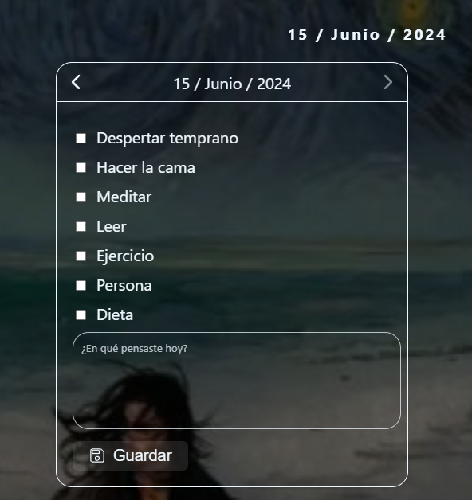

#MyProgress


### Welcome to **MyProgress**!

**MyProgress** is the definitive application to manage your daily tasks, track your statistics and check your progress in an effective and visually attractive way. Ideal to keep you organized and motivated.

---

## Features

- **Daily Task Management**: Create, edit and organize your daily tasks.


- **Statistics and Graphs**: View your progress with intuitive graphs


---

## Usage

1. **Clone the repository**:
 ```sh
 git clone https://github.com/AdrianPalacios03/XenoChangeWeb
 ```
2. **Install the dependencies**:
 ```sh
 npm install
 ```
3. **Start the application**:
 ```sh
 npm run dev
 ```

## Use
1. **Task Management**

2. **Statistics and Graphs**

3. **Progress History**

---

## Technologies

- **Frontend**:
 - **React**: JavaScript library to build user interfaces.
 - **TypeScript**: JavaScript superset that adds static typing.
 - **Vite**: Web project construction tool.
 - **Redux**: Library for managing the state of the application.
 - **Chart.js**: Library for creating charts.

- **Backend**:
 - **Firebase**: Mobile and web application development platform.

## License
This project is licensed under the **Creative Commons Attribution-NonCommercial-ShareAlike 4.0 International License**. For more information, visit the following link: [https://creativecommons.org/licenses/by-nc-sa/4.0/](https://creativecommons.org/licenses/by-nc-sa/4.0/).

## Contribution

Contributions are always welcome! Please follow the following steps:

1. Make a **fork** of the project.
2. Create a new **branch** (`git checkout -b feature/new-feature`).
3. Make the necessary changes and **commit** your changes (`git commit -am 'Add new functionality'`).
4. **Upload** your changes (`git push origin feature/new-functionality`).
5. Open a **pull request**.
